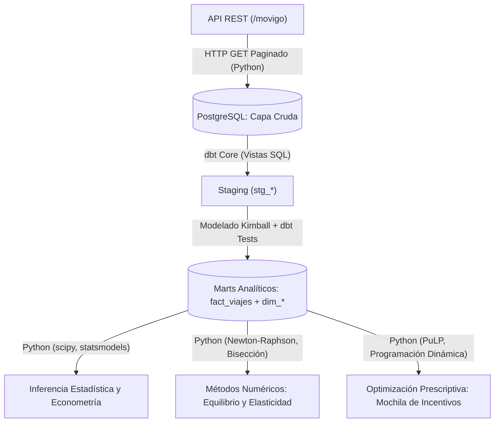

# 6. Marco Teórico

## 6.1 Mercados Bilaterales de Movilidad y Tarificación Dinámica (Surge Pricing)

Las plataformas de transporte selectivo bajo demanda (*ride-hailing*) operan bajo la estructura económica de los **mercados bilaterales (*two-sided markets*)** (Rochet & Tirole, 2003; Armstrong, 2006). En estos entornos, la plataforma actúa como intermediario tecnológico entre dos grupos de agentes interdependientes: los pasajeros que demandan traslados y los socios conductores independientes que suministran capacidad vehicular.

El desafío operativo cardinal de este modelo radica en la volatilidad espaciotemporal de la demanda frente a una oferta vehicular con rigideces de desplazamiento físico. Para coordinar ambos lados del mercado en tiempo real, las plataformas implementan algoritmos de **tarificación dinámica (*surge pricing*)** (Cachon et al., 2017).

Desde la perspectiva teórica, el multiplicador dinámico cumple dos funciones primordiales:
1. **Racionamiento de Demanda:** Eleva el costo del servicio en zonas o momentos saturados, incentivando a los usuarios con viajes postergables o elásticos a desistir de la solicitud.
2. **Incentivo de Oferta:** Incrementa los ingresos esperados de los choferes, atrayendo unidades desocupadas hacia los focos de alta demanda.

No obstante, cuando el multiplicador supera los umbrales de tolerancia económica de los usuarios o cuando la congestión vial impide que los vehículos lleguen a tiempo, el mecanismo puede colapsar, induciendo tasas severas de cancelación mutua y distorsiones territoriales (Castillo et al., 2022).

---

## 6.2 Microeconomía de la Demanda: Elasticidad-Precio y Cancelación de Viajes

El comportamiento del pasajero ante la cotización de un viaje se rige por la **teoría de la demanda y la elasticidad-precio** (Varian, 2014). La elasticidad-precio de la demanda ($\varepsilon$) mide la variación porcentual en la cantidad demandada de viajes ($Q$) ante un cambio porcentual en la tarifa ($P$):

$$\varepsilon = \frac{\Delta Q / Q}{\Delta P / P} = \frac{\partial Q}{\partial P} \cdot \frac{P}{Q}$$

En servicios de transporte urbano:
* **Demanda Inelástica ($|\varepsilon| < 1$):** El usuario requiere movilizarse de forma imperativa (ej. emergencias, compromisos laborales estrictos en horas pico) y tolera incrementos moderados en la tarifa.
* **Demanda Elástica ($|\varepsilon| > 1$):** El usuario posee alternativas viables o alta sensibilidad presupuestaria, reaccionando al incremento del multiplicador mediante el desistimiento inmediato o la **cancelación del viaje tras haber solicitado el servicio**.

En MoviGo, la tarifa final se define paramétricamente mediante la fórmula:

$$\text{TarifaBase} = \text{BajadaBandera}_z + (18.0 \times \text{distancia\_km}) + (4.5 \times \text{duracion\_minutos})$$

$$\text{TarifaFinal} = \text{TarifaBase} \times \text{multiplicador\_dinamico}$$

Donde el multiplicador dinámico oscila habitualmente entre $1.00\times$ y $2.80\times$, con techos extraordinarios de $3.20\times$ durante tormentas. Cuando la tarifa final resultante excede el excedente del consumidor, o cuando el tiempo de espera estimado se dilata debido a la congestión, se desencadena la cancelación del viaje (`estado_viaje = 'cancelado_usuario'`), representando una pérdida económica neta tanto para la plataforma como para el conductor.

---

## 6.3 Equidad Socio-Espacial y Disparidad Territorial en Managua

La teoría de la justicia espacial y el acceso al transporte urbano postula que las tarifas y la disponibilidad de los servicios de movilidad no deben discriminar ni excluir a las poblaciones de menores recursos (Harvey, 1973; Martens, 2016).

En el municipio de Managua, la estructura urbana se caracteriza por una marcada heterogeneidad y fragmentación espacial. MoviGo divide la capital en 12 cuadrantes operativos agrupados en cuatro estratos socioeconómicos:
* **Alto:** Villa Fontana, Las Colinas, Santo Domingo (bajada de bandera de C$ 70 a C$ 80 NIO).
* **Medio:** Los Robles, Altamira, Bolonia, Bello Horizonte, Linda Vista (bajada de bandera de C$ 48 a C$ 55 NIO).
* **Comercial:** Metrocentro / Eje Corporativo UCA (bajada de bandera de C$ 60 NIO).
* **Popular:** Ciudad Jardín, Mercado Oriental, Mercado Roberto Huembes (bajada de bandera de C$ 35 a C$ 40 NIO).

El estrato del cuadrante no solo condiciona la tarifa inicial, sino también los métodos de pago dominantes: en cuadrantes populares predomina el uso de **efectivo**, mientras que en estratos altos predomina la **tarjeta de crédito/débito** y las **billeteras digitales**. Un aumento abrupto en el multiplicador dinámico tiene un impacto asimétrico: mientras un usuario con tarjeta puede absorber el cargo marginal, un usuario con efectivo en un mercado popular que dispone de un monto exacto se ve obligado a cancelar el viaje al verse sobrepasado su presupuesto líquido.

---

## 6.4 Arquitectura de Datos y Paradigma ELT vía API REST

Para investigar empíricamente este fenómeno, se requiere una arquitectura analítica moderna capaz de transformar registros transaccionales dispersos en un repositorio estructurado para la toma de decisiones. 

Dado que MoviGo expone sus datos exclusivamente mediante una **API REST pública (`/movigo`)**, la solución tecnológica se estructura bajo el paradigma **ELT (Extract, Load, Transform)**:

### 1. Ingesta y Carga Cruda (Python &rarr; PostgreSQL):
Un script automatizado en Python (`httpx`/`requests`) consume los endpoints `/movigo/zonas`, `/movigo/usuarios`, `/movigo/conductores`, `/movigo/campanas`, `/movigo/clima`, `/movigo/viajes` y `/movigo/telemetria`. Implementa paginación sistemática (`limit=200`, `offset` incremental) y asegura la integridad relacional antes de persistir los datos crudos en PostgreSQL. Adicionalmente, genera archivos **Parquet** con hashes criptográficos **SHA-256** para auditoría y trazabilidad DataOps.

### 2. Transformación Analítica con dbt Core:
La orquestación del almacén de datos se delega en **dbt (Data Build Tool)**, permitiendo versionar las transformaciones en SQL modular, materializar tablas intermedias y desacoplar la capa de staging de la capa de entrega analítica.

---

## 6.5 Modelado Dimensional Kimball para Análisis de Tarifas y Cancelaciones

El diseño dimensional sigue los principios de Ralph Kimball, definiendo la medición de los viajes como el proceso de negocio central a través de un **Esquema en Estrella (*Star Schema*)**:

### Tabla de Hechos Atómica: `fact_viajes`
Cada registro modela un viaje solicitado en la plataforma (> 77,000 registros anuales):
* **Métricas Monetarias:** `tarifa_base`, `multiplicador_dinamico`, `tarifa_final`, `propina`.
* **Métricas Temporales y de Espera:** `duracion_minutos`, `distancia_km`, `tiempo_espera_minutos` ($\text{fecha\_hora\_inicio} - \text{fecha\_hora\_solicitud}$).
* **Métricas de Calidad y Resultado:** `estado_viaje` (`completado`, `cancelado_usuario`, `cancelado_conductor`, `no_asignado`), `calificacion_usuario`, `calificacion_conductor`.
* **Llaves Foráneas a Dimensiones Conformadas.**

### Dimensiones Conformadas:
* **`dim_zona_origen` / `dim_zona_destino`:** Cuadrante urbano, estrato (`alto`, `medio`, `popular`, `comercial`), coordenadas WGS84, radio de cobertura y tarifa de bajada de bandera.
* **`dim_tiempo`:** Fecha, hora, día de la semana, clasificación de franja horaria (pico matutino, valle, pico vespertino, nocturno).
* **`dim_clima`:** Registro exógeno diario sincronizado: precipitación acumulada (mm), temperatura (°C), índice de congestión vial (1.00 a 3.50) y condición atmosférica.
* **`dim_conductor`:** Categoría de servicio (`movigo_estandar`, `movigo_comfort`, `movigo_moto`), placa, modelo, calificación histórica y tasa de aceptación.
* **`dim_usuario`:** Identificador, teléfono, método de pago habitual (`efectivo`, `tarjeta`, `billetera_digital`) y calificación media.

### Integridad y Llaves Subrogadas Hash (MD5):
Todas las dimensiones incorporan **Llaves Subrogadas (*Surrogate Keys*)** deterministas generadas mediante funciones hash MD5, desacoplando el almacén analítico de los IDs operativos de la API. La calidad de los datos se audita mediante pruebas automáticas (*dbt tests*) que verifican unicidad, no nulidad y reglas de dominio (`multiplicador_dinamico >= 1.0`, tarifas positivas y relaciones foráneas válidas).

---

## 6.6 Inferencia Estadística y Econometría del Servicio (Estadística II)

Sobre el Data Mart consolidado se despliegan modelos estadísticos formales para contrastar el comportamiento de las tarifas y las cancelaciones:

### 1. Regresión Lineal Múltiple de la Demanda Diaria:
Se modela la relación entre el volumen de solicitudes diarias y los choques exógenos:

$$\text{ViajesDiarios} = \beta_0 + \beta_1 (\text{Precipitacion}_{mm}) + \beta_2 (\text{IndiceCongestion}) + \epsilon$$

evaluando la significancia global del modelo mediante la tabla ANOVA completa ($SCA$, $SCE$, $SCT$, grados de libertad y estadístico $F$).

### 2. Verificación de Supuestos Clásicos de Gauss-Markov:
* **Normalidad de Residuos:** Pruebas formales de Shapiro-Wilk y Jarque-Bera.
* **Homocedasticidad:** Pruebas de Breusch-Pagan y White para descartar varianza no constante.
* **Independencia de Errores:** Estadístico de Durbin-Watson para verificar ausencia de autocorrelación serial temporal.

### 3. Batería de Pruebas de Hipótesis Formales:
* **Prueba $t$ de Welch:** Evaluar si el multiplicador dinámico ($m > 1.25\times$) genera un incremento estadísticamente significativo en la tarifa final respecto a la tarifa base ($p < 0.05$).
* **Prueba $z$ de Dos Proporciones:** Determinar si la tasa de cancelación en horas pico (07:00–08:59, 17:00–18:59) difiere significativamente de la tasa en horas valle ($p < 0.05$).
* **ANOVA de un Factor:** Contrastar si la duración de los viajes y los multiplicadores aplicados difieren significativamente según el estrato socioeconómico de la zona de destino (`alto`, `medio`, `popular`, `comercial`).
* **Prueba de Independencia Chi-Cuadrado ($\chi^2$):** Verificar la dependencia estadística entre el `metodo_pago` y el `estrato_socioeconomico` del cuadrante de origen ($p < 0.01$).

---

## 6.7 Métodos Numéricos en Equilibrio Tarifario y Elasticidad

El análisis numérico provee herramientas para calcular puntos de balance y derivar sensibilidades donde las funciones analíticas carecen de formas cerradas:

### 1. Búsqueda de Raíces para el Multiplicador de Equilibrio:
A partir de la función de exceso de demanda empírica $f(m) = \text{Demanda}(m) - \text{Oferta}(m)$, se busca el multiplicador de equilibrio $m^*$ que satisfaga:

$$f(m^*) = 0$$

Se implementan y comparan los métodos iterativos de **Bisección** (robusto pero de convergencia lineal) y **Newton-Raphson** (convergencia cuadrática local mediante aproximación de la derivada):

$$m_{k+1} = m_k - \frac{f(m_k)}{f'(m_k)}$$

reportando número de iteraciones, tolerancia y velocidad de convergencia.

### 2. Diferenciación Numérica de la Elasticidad-Precio:
Se aproxima numéricamente la derivada de la demanda respecto a la tarifa mediante el esquema de **diferencias finitas centradas de orden $\mathcal{O}(h^2)$**:

$$f'(P) \approx \frac{Q(P + h) - Q(P - h)}{2h}$$

calculando el coeficiente puntual de elasticidad $\varepsilon = f'(P) \cdot \frac{P}{Q(P)}$ para identificar franjas de inelasticidad y zonas de alta sensibilidad al precio.

### 3. Integración Numérica (Regla de Simpson 1/3):
A partir de la curva horaria continua de intensidad de viajes $q(t)$ a lo largo de las 24 horas del día, se aplica la **Regla de Simpson 1/3** para calcular numéricamente el volumen diario acumulado de viajes:

$$\int_a^b q(t) \, dt \approx \frac{\Delta t}{3} \left[ q(t_0) + 4 \sum_{i \text{ impar}} q(t_i) + 2 \sum_{j \text{ par}} q(t_j) + q(t_n) \right]$$

---

## 6.8 Optimización Prescriptiva: El Problema de la Mochila (Knapsack 0/1) para Incentivos a la Flota

Como alternativa a la tarificación dinámica excesiva que expulsa a los usuarios vulnerables, la plataforma dispone de campañas de bonificación económica para socios conductores (`/movigo/campanas`). El objetivo empresarial es seleccionar la combinación óptima de programas que maximice las horas adicionales de conexión vehicular bajo una **restricción presupuestaria de C$ 120,000 NIO**.

Matemáticamente, este dilema se formula como un **Problema de la Mochila Binaria (0/1 Knapsack)**:

$$\max \sum_{k=1}^K v_k \cdot z_k$$

sujeto a:

$$\sum_{k=1}^K w_k \cdot z_k \le W_{\max}$$

$$z_k \in \{0, 1\}, \quad \forall k \in \{1, \dots, K\}$$

Donde:
* $z_k$: Variable de decisión binaria ($1$ si se activa la campaña de incentivos $k$, $0$ en caso contrario).
* $v_k$: Retorno esperado en **incremento de horas de conexión** de la flota (`incremento_horas_conexion`).
* $w_k$: Costo presupuestario en Córdobas asignado al bono (`costo_presupuesto_nio`).
* $W_{\max} = 120\,000$ NIO: Presupuesto total máximo disponible.

Este modelo prescriptivo se resuelve mediante **Programación Dinámica**, demostrando cómo la optimización de incentivos a conductores permite equilibrar la oferta vehicular sin encarecer abusivamente la tarifa al pasajero.
